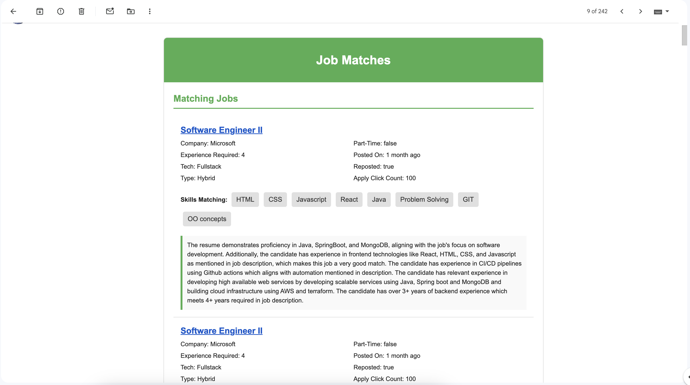

# AI JOB MATCHER

This tool helps to find matching jobs based on the details in the resume. The tool does the following
- Logs into Linkedin account
- Searches for jobs with the job title
- Gets all the jobs
- Uses AI to match the resume with the job description
  - Uses gemini-1.5-pro model
  - Also has the ability to connect to Huggingface models using Huggingface inference api
- Once it finds the matching jobs from the available jobs, the AI model provides the results in the json format
- Sends an email to the user on all the matching and unmatching jobs as shown in the following images

